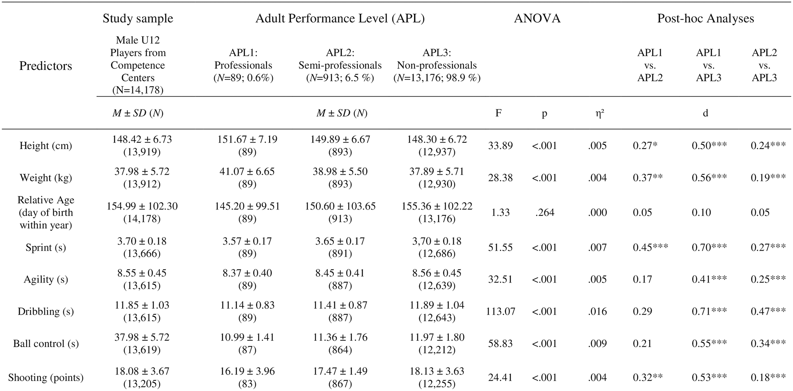

# PUI2018 HW 6 session 2 (evening)

## ASSIGNED READING:

## ASSIGNMENTS:

### Submission Info:

For Assignment 1: work alone. 

For Assignment 2: work in groups of 2. Strictly no more than 3!

## Assignment 2: Literature choices of statistical tests

Work with one, or maximum two people. 

Choose three tests from the table in the slides 

one in the top potrion of the chart (chi-sq, t-test, and the ANOVA family of tests) where you are looking for differences between groups, and one in the bottom portion where you are looking for relationships bewteen the dependent and independent variables (correlation, regression, path analysis), and a logistic regression.

Go to the main web page of the journal [PLOS ONE](http://journals.plos.org/plosone/) and search for articles that use that test (**DO NOT USE THE ARTICLE I USED FOR THE CLASS EXAMPLE:** http://journals.plos.org/plosone/article?id=10.1371/journal.pone.0062593).

Put the name of your tests (one by one) in the search (you can also use the advanced search) and choose a paper that uses the test you selected. Read the relevant portions of the paper (the abstract, and then a search for occurrences of the test name may be sufficient!) and identify what are the Dependent Variables (DV), Independent Variables (IV), and, if applicable, control variables (remember class 2 slides if you forgot), how many they are, and what type they are (categorical, continuous...). 

Write out the number of DV, type of DV, number of IV, type of IV, number of control variables, kind of questions as a [table](https://github.com/adam-p/markdown-here/wiki/Markdown-Cheatsheet#tables) in your README.md file, filling in the same fields as in the first table in the literature about ["When to use what test?"](https://www.ncbi.nlm.nih.gov/pmc/articles/PMC3116565/). 

This is a template for the table. To see how it is written clock on the Raw link to see this README.md in its raw unrendered format.

| **Statistical Analyses**	|  **IV(s)**  |  **IV type(s)** |  **DV(s)**  |  **DV type(s)**  |  **Control Var** | **Control Var type**  | **Question to be answered** | **_H0_** | **alpha** | **link to paper**| 
|:----------:|:----------|:------------|:-------------|:-------------|:------------|:------------- |:------------------|:----:|:-------:|:-------|
ANOVA	| 1, Weight 2, Height 3, Relative Age 4, Shooting 5, Sprint(20m) 6, Agility 7, Dribbling 8, Ball Control  | quantitative | 1, Speed Ability Rating 2, Technical Ability Rating| quantitative | N/A | N/A | 	Are the 8 independent variables(factors) listed above significant enough to demonstrate adequate speed ability and technical ability ratings that ultimately indicate player's adult performance level (APL) | Factors not statistically significant to determine APL | 0.05 | [The influence of speed abilities and technical skills in early adolescence on adult success in soccer: A long-term prospective analysis using ANOVA and SEM approaches](https://journals.plos.org/plosone/article?id=10.1371/journal.pone.0182211) |
Correlation	|1. Nose Video, 2. Hair Video(participants observe a video of a model who engages in two classes of different behaviors(e.g., nose touching vs. hair touching))|Categorical|Amount of Performed Action|Numerical|1. Amount of friends 2. Learning style 3. Regulatory focus|Categorical|Are mimicry and automatic imitation are correlated| Mimicry and automatic imitation are not positively correlated|0.05|[Mimicry and automatic immitation are not correlated] (https://journals.plos.org/plosone/article?id=10.1371/journal.pone.0183784)|
  
  
  Include the main plot of the paper (the plot that summarized the result)
  

### GRADING: 

Your HW6\_\<netID\> README.md should show, in addition to the usual items (the scope of the homework, the group partecipants, your role in the group work) a two-row tables like the one above explaining the use of two tests in papers published in PLOS One.

